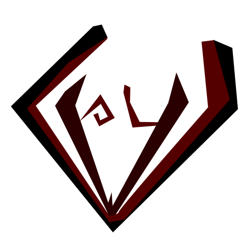

  

# CVPL - Cervus Public Licence

**Cervus Public License** (CvPL) is a specialized weak copyleft license designed specifically for the ecosystem of the Cervus OS operating system.

---

### Cervus Public License (CvPL)
**Version 1.0, June 2026**  
*Copyright (c) VeoQeo, hewlets and contributors.*

#### TERMS AND CONDITIONS FOR USE, REPRODUCTION, AND DISTRIBUTION

##### 1. DEFINITIONS
* **"License"** shall mean the terms and conditions for use, reproduction, and distribution as defined by this document.
* **"Licensor"** shall mean the copyright owner or entity authorized by the copyright owner that is granting the License.
* **"The Software"** means the original work of authorship protected by copyright and distributed under this License, including all source code files and binaries.
* **"Modifications"** means any addition to, deletion from, or change to the substance or structure of the existing source code files of the Software.
* **"Independent Modules"** shall mean separate, independent software components, applications, or hardware drivers that are not Modifications of the Software's original source files.
* **"Combined Work"** shall mean a broader software system or hardware-software integration created by combining, interfacing, or linking the Software with Independent Modules.
* **"Source File-Level Copyleft"** means that any Modifications made directly to the existing source code files of the Software must be governed exclusively by this License.

##### 2. SOURCE FILE-LEVEL COPYLEFT OBLIGATIONS
If You distribute or otherwise make available the Software or any Modifications, You must make the corresponding source code of the Software and such Modifications available in a machine-readable format via standard public software repositories for a period of no less than three years following the distribution of the binaries. This obligation applies regardless of whether the Software is distributed standalone, integrated into a larger work, or embedded in hardware.

##### 3. EXPLICIT EXCEPTION FOR COMBINED WORKS AND INTERFACING
* **a) Definition of Combined Work:** For the purposes of this Section, a "Combined Work" is a broader software system or hardware-software integration created by combining or linking the Software with separate, independent software modules, applications, or hardware drivers ("Independent Modules") that are not Modifications of the Software's original source files.
* **b) Grant of Exception:** As an explicit exception to the Source File-Level Copyleft obligations in Section 2, the Licensor grants You permission to create, distribute, and execute Combined Works, and to link, compile, or interface the Software with Independent Modules, regardless of the license terms governing those Independent Modules.
* **c) Scope of Permitted Interfacing:** This exception applies to, but is not limited to:
  * Interfacing via system calls (syscalls), Application Binary Interfaces (ABI), or Application Programming Interfaces (API).
  * Static linking, dynamic linking, or memory execution of Independent Modules alongside the Software within the same address space or system architecture.
  * The inclusion of unmodified header files from the Software into Independent Modules solely to enable compilation, data structure alignment, and structural interfacing.
* **d) License Boundary:** The creation or distribution of a Combined Work does not extend the Source File-Level Copyleft obligations of this License to the Independent Modules. You may distribute Independent Modules under any license of Your choosing, including proprietary terms. However, any Modifications made directly to the source code files of the Software must still be made available under the exact terms of this License pursuant to Section 2.

##### 4. HARDWARE DEPLOYMENT AND DECOUPLING
This License does not impose restrictions on the deployment or execution of the Software within embedded systems or hardware devices with restricted modification access (e.g., secure boot environments).

The Licensor explicitly waives any implied obligation requiring You to provide end-users with cryptographic keys, authorization codes, or hardware-specific methods necessary to install modified versions of the Software, provided that the Source File-Level Copyleft obligations for the Software's source code are fully satisfied.

##### 5. BALANCED PATENT GRANT AND RETALIATION
Subject to the terms and conditions of this License, each contributor hereby grants to You a perpetual, worldwide, non-exclusive, no-charge, royalty-free, irrevocable patent license to make, have made, use, offer to sell, sell, import, and otherwise transfer the Software.

This patent grant applies exclusively to the Software and does not extend to Independent Modules.

If You institute patent litigation against any entity (including a cross-claim or counterclaim in a lawsuit) alleging that the Software constitutes direct or contributory patent infringement, then any patent licenses granted to You under this License for the Software shall terminate automatically as of the date such litigation is filed.

##### 6. COPYRIGHT NOTICE
The above copyright notice and this permission notice shall be included in all copies or substantial portions of the Software.

##### 7. DISCLAIMER OF WARRANTY AND LIMITATION OF LIABILITY
THE SOFTWARE IS PROVIDED "AS IS", WITHOUT WARRANTY OF ANY KIND, EXPRESS OR IMPLIED, INCLUDING BUT NOT LIMITED TO THE WARRANTIES OF MERCHANTABILITY, FITNESS FOR A PARTICULAR PURPOSE AND NONINFRINGEMENT. IN NO EVENT SHALL THE AUTHORS OR COPYRIGHT HOLDERS BE LIABLE FOR ANY CLAIM, DAMAGES OR OTHER LIABILITY, WHETHER IN AN ACTION OF CONTRACT, TORT OR OTHERWISE, ARISING FROM, OUT OF OR IN CONNECTION WITH THE SOFTWARE OR THE USE OR OTHER DEALINGS IN THE SOFTWARE.
